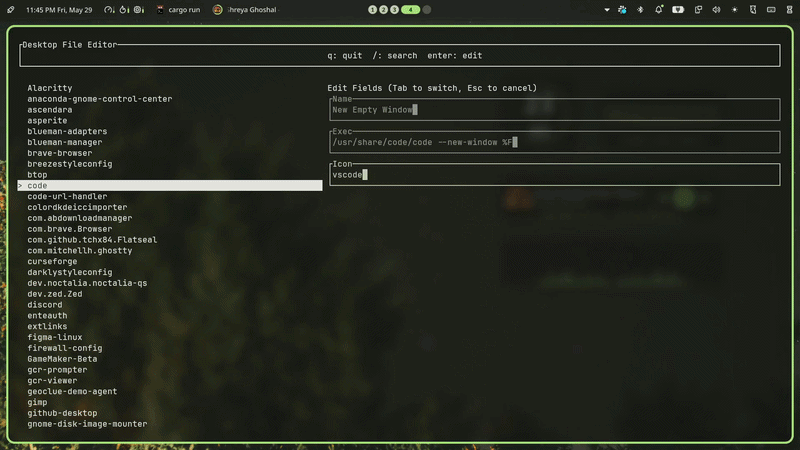

# Desktop File Editor TUI
A small TUI app written in rust to edit `.desktop` files for your app launcher on the go.
Built using **Ratatui** & **Crossterm-backend**



## Installation
Binary is on Cargo now!
```sh
cargo install desktop-file-editor
# Run the binary
dfe
```

```sh
git clone https://codeberg.org/chish/desktop-file-editor && cd desktop-file-editor

#Run The project 
cargo run
```
After I am done with all basic features, I will also publish pre-built binaries :D

## Current Features
- Easy To Use
- I guess it has good UI
- Lightweight & fast
- Search the .desktop files directly in TUI
- Updates Desktop Database automatically. Make sure you have desktop-file-utils.

## License
I am using [MIT](LICENSE) License for the project

## Credits
Thanks to Hack Club's [Resolution Rust](https://resolution.hackclub.com/) program to help me learn rust while building cool projects!